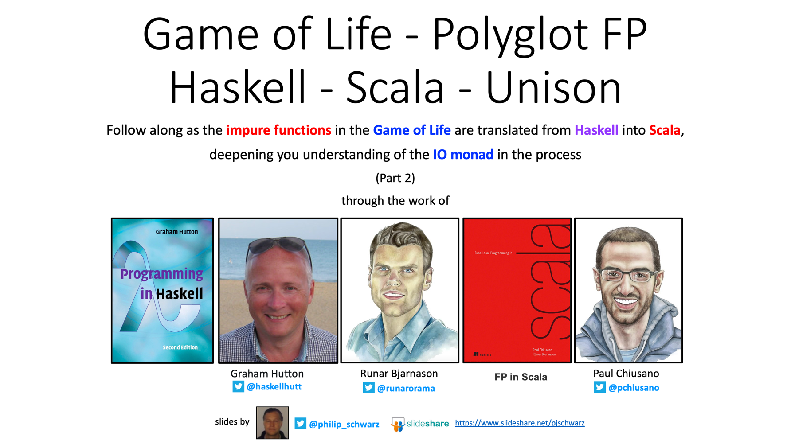

# My Slide Decks

This page is WIP

* [List of hyperlinked titles](#hyperlinked-title)
* [List of hyperlinked titles, each accompanied by first slide](#hyperlinked-title-plus-first-slide)
* [List of Slide Deck Series](#list-of-slide-deck-series)

## Hyperlinked titles (sorted by publication date) 
* [The aggregate function - from sequential and parallel folds to parallel aggregation - Java and Scala](https://www.slideshare.net/pjschwarz/the-aggregate-function-from-sequential-and-parallel-folds-to-parallel-aggregation-java-and-scala)
* [Nat, List and Option Monoids - from scratch - Combining and Folding - an example](https://www.slideshare.net/pjschwarz/nat-list-and-option-monoids-from-scratch-combining-and-folding-an-example)
* [The Sieve of Eratosthenes - Part 2](https://www.slideshare.net/pjschwarz/the-sieve-of-eratosthenes-part-ii-genuine-versus-unfaithful-sieve-haskell-and-scala)
* [Sum and Product Types - The Fruit Salad & Fruit Snack Example - From F# to Haskell, Scala and Java](https://www.slideshare.net/pjschwarz/sum-and-product-types-the-fruit-salad-fruit-snack-example-from-f-to-haskell-scala-and-java)
* [Algebraic Data Types for Data Oriented Programming](https://www.slideshare.net/pjschwarz/algebraic-data-types-fordata-oriented-programming-from-haskell-and-scala-to-java)
* [Jordan Peterson - The Pursuit of Meaning and Related Axioms](https://www.slideshare.net/pjschwarz/jordan-peterson-the-pursuit-of-meaning-and-related-axioms)
* [The Sieve of Eratosthenes - Part 1](https://www.slideshare.net/pjschwarz/the-sieve-of-eratosthenes-part-1)
* [The Uniform Access Principle](https://www.slideshare.net/pjschwarz/the-uniform-access-principle)
* [Computer Graphics in Java and Scala - Part 1b](https://www.slideshare.net/pjschwarz/computer-graphics-in-java-and-scala-part-1b)
* [The Expression Problem - Part 2](https://www.slideshare.net/pjschwarz/the-expression-problem-part-2)
* [Computer Graphics in Java and Scala - Part 1](https://www.slideshare.net/pjschwarz/computer-graphics-in-java-and-scala-part-1)
* [The Expression Problem - Part 1](https://www.slideshare.net/pjschwarz/the-expression-problem-part-1)
* [Scala and Java Side by Side - The Result of Martin Fowler’s 1st Refactoring Example](https://www.slideshare.net/pjschwarz/side-by-side-scala-and-java-adaptations-of-martin-fowlers-javascript-refactoring-example-251038072)
* [Refactoring: A First Example - Martin Fowler’s First Example of Refactoring, Adapted to Java](https://www.slideshare.net/pjschwarz/refactoring-a-first-example-martin-fowlers-first-example-of-refactoring-adapted-to-java)
* [Refactoring: A First Example - Martin Fowler’s First Example of Refactoring, Adapted to Scala](https://www.slideshare.net/pjschwarz/refactoring-a-first-example-martin-fowlers-first-example-of-refactoring-adapted-to-scala)
* [‘go-to’ general-purpose sequential collections - from Java To Scala](https://www.slideshare.net/pjschwarz/goto-generalpurpose-sequential-collections-from-java-to-scala)
* [The Functional Programming Triad of map, filter and fold - Polyglot FP for Fun and Profit - Scheme, Clojure, Scala, Haskell, Unison](https://www.slideshare.net/pjschwarz/the-functional-programming-triad-of-map-filter-and-fold)
* [Functional Core and Imperative Shell - Game of Life Example - Haskell and Scala](https://www.slideshare.net/pjschwarz/functional-core-and-imperative-shell-game-of-life-example-haskell-and-scala)
* [N-Queens Combinatorial Problem - Polyglot FP for Fun and Profit – Haskell and Scala - Part 4](https://www.slideshare.net/pjschwarz/n-queens-combinatorial-problem-polyglot-fp-for-fun-and-profit-haskell-and-scala-part-4)
* [Quicksort - a whistle-stop tour of the algorithm in five languages and four paradigms](https://www.slideshare.net/pjschwarz/quicksort-a-whistlestop-tour-of-the-algorithm-in-five-languages-and-four-paradigms)
* [N-Queens Combinatorial Problem - Polyglot FP for Fun and Profit – Haskell and Scala - Part 3](https://www.slideshare.net/pjschwarz/nqueens-combinatorial-problem-polyglot-fp-for-fun-and-profit-haskell-and-scala-part-3)
* [Left and Right Folds Comparison of a mathematical definition and a programmatic one](https://www.slideshare.net/pjschwarz/left-and-right-folds-comparison-of-a-mathematical-definition-and-a-programmatic-one-polyglot-fp-for-fun-and-profit-haskell-and-scala)
* [N-Queens Combinatorial Problem - Polyglot FP for Fun and Profit – Haskell and Scala - Part 2](https://www.slideshare.net/pjschwarz/nqueens-combinatorial-problem-polyglot-fp-for-fun-and-profit-haskell-and-scala-part-2)
* [N-Queens Combinatorial Problem - Polyglot FP for Fun and Profit – Haskell and Scala - Part 1](https://www.slideshare.net/pjschwarz/nqueens-combinatorial-problem-polyglot-fp-for-fun-and-profit-haskell-and-scala-part-1)
* [Sierpinski’s Triangle - Polyglot FP for Fun and Profit - Haskell and Scala](https://www.slideshare.net/pjschwarz/sierpinski-triangle-polyglot-fp-for-fun-and-profit-haskell-and-scala)
* [Function Applicative for Great Good of Palindrome Checker Function - Polyglot FP for Fun and Profit - Haskell and Scala](https://www.slideshare.net/pjschwarz/function-applicative-for-great-good-of-palindrome-checker-function-polyglot-fp-for-fun-and-profit-haskell-and-scala)
* [Scala 3 enum for a terser Option Monad Algebraic Data Type](https://www.slideshare.net/pjschwarz/scala-3-enum-for-a-terser-option-monad-algebraic-data-type)
* [Folding Unfolded - Polyglot FP for Fun and Profit - Haskell and Scala - Part 5](https://www.slideshare.net/pjschwarz/https://www.slideshare.net/pjschwarz/folding-unfolded-polyglot-fp-for-fun-and-profit-haskell-and-scala-part-5)
* [The Functional Programming Triad of Folding, Scanning and Iteration - a first example in Scala and Haskell - Polyglot FP for Fun and Profit](https://www.slideshare.net/pjschwarz/the-functional-programming-triad-of-folding-scanning-and-iteration-a-first-example-in-scala-and-haskell-polyglot-fp-for-fun-and-profit)
* [Game of Life - Polyglot FP - Haskell - Scala - Unison - Part 1](https://www.slideshare.net/pjschwarz/game-of-life-polyglot-fp-haskell-scala-unison-part-1)
* [Game of Life - Polyglot FP - Haskell - Scala - Unison - Part 2](https://www.slideshare.net/pjschwarz/game-of-life-polyglot-fp-haskell-scala-unison-part-2)
* [Game of Life - Polyglot FP - Haskell - Scala - Unison - Part 3](https://www.slideshare.net/pjschwarz/game-of-life-polyglot-fp-haskell-scala-unison-part-3)
* [Folding Unfolded - Polyglot FP for Fun and Profit - Haskell and Scala - Part 4](https://www.slideshare.net/pjschwarz/folding-unfolded-polyglot-fp-for-fun-and-profit-haskell-and-scala-part-4)

## Hyperlinked titles, each accompanied by first slide (sorted by publication date) 

### [The aggregate function - from sequential and parallel folds to parallel aggregation - Java and Scala](https://www.slideshare.net/pjschwarz/the-aggregate-function-from-sequential-and-parallel-folds-to-parallel-aggregation-java-and-scala)

---

---

### [Nat, List and Option Monoids - from scratch - Combining and Folding - an example](https://www.slideshare.net/pjschwarz/nat-list-and-option-monoids-from-scratch-combining-and-folding-an-example)

---

---

### [The Sieve of Eratosthenes - Part 2](https://www.slideshare.net/pjschwarz/the-sieve-of-eratosthenes-part-ii-genuine-versus-unfaithful-sieve-haskell-and-scala)

---

---

### [Sum and Product Types - The Fruit Salad & Fruit Snack Example - From F# to Haskell, Scala and Java](https://www.slideshare.net/pjschwarz/sum-and-product-types-the-fruit-salad-fruit-snack-example-from-f-to-haskell-scala-and-java)

---

---

### [Algebraic Data Types for Data Oriented Programming](https://www.slideshare.net/pjschwarz/algebraic-data-types-fordata-oriented-programming-from-haskell-and-scala-to-java)

---

---

### [Jordan Peterson - The Pursuit of Meaning and Related Axioms](https://www.slideshare.net/pjschwarz/jordan-peterson-the-pursuit-of-meaning-and-related-axioms)

---

---

### [The Sieve of Eratosthenes - Part 1](https://www.slideshare.net/pjschwarz/the-sieve-of-eratosthenes-part-1)

---

---

### [The Uniform Access Principle](https://www.slideshare.net/pjschwarz/the-uniform-access-principle)

---

---

### [Computer Graphics in Java and Scala - Part 1b](https://www.slideshare.net/pjschwarz/computer-graphics-in-java-and-scala-part-1b)

---

---

### [The Expression Problem - Part 2](https://www.slideshare.net/pjschwarz/the-expression-problem-part-2)

---

---

### [Computer Graphics in Java and Scala - Part 1](https://www.slideshare.net/pjschwarz/computer-graphics-in-java-and-scala-part-1)

---

---

### [The Expression Problem - Part 1](https://www.slideshare.net/pjschwarz/the-expression-problem-part-1)

---

---

### [Scala and Java Side by Side - The Result of Martin Fowler’s 1st Refactoring Example](https://www.slideshare.net/pjschwarz/side-by-side-scala-and-java-adaptations-of-martin-fowlers-javascript-refactoring-example-251038072)

---

---

### [Refactoring: A First Example - Martin Fowler’s First Example of Refactoring, Adapted to Java](https://www.slideshare.net/pjschwarz/refactoring-a-first-example-martin-fowlers-first-example-of-refactoring-adapted-to-java)

---

---

### [Refactoring: A First Example - Martin Fowler’s First Example of Refactoring, Adapted to Scala](https://www.slideshare.net/pjschwarz/refactoring-a-first-example-martin-fowlers-first-example-of-refactoring-adapted-to-scala)

---

---

### [‘go-to’ general-purpose sequential collections - from Java To Scala](https://www.slideshare.net/pjschwarz/goto-generalpurpose-sequential-collections-from-java-to-scala)

---

---

### [The Functional Programming Triad of map, filter and fold - Polyglot FP for Fun and Profit - Scheme, Clojure, Scala, Haskell, Unison](https://www.slideshare.net/pjschwarz/the-functional-programming-triad-of-map-filter-and-fold)

---

---

### [Functional Core and Imperative Shell - Game of Life Example - Haskell and Scala](https://www.slideshare.net/pjschwarz/functional-core-and-imperative-shell-game-of-life-example-haskell-and-scala)

---

---

### [N-Queens Combinatorial Problem - Polyglot FP for Fun and Profit – Haskell and Scala - Part 4](https://www.slideshare.net/pjschwarz/n-queens-combinatorial-problem-polyglot-fp-for-fun-and-profit-haskell-and-scala-part-4)

---

---

### [Quicksort - a whistle-stop tour of the algorithm in five languages and four paradigms](https://www.slideshare.net/pjschwarz/quicksort-a-whistlestop-tour-of-the-algorithm-in-five-languages-and-four-paradigms)

---

---

### [N-Queens Combinatorial Problem - Polyglot FP for Fun and Profit – Haskell and Scala - Part 3](https://www.slideshare.net/pjschwarz/nqueens-combinatorial-problem-polyglot-fp-for-fun-and-profit-haskell-and-scala-part-3)

---

---

### [Left and Right Folds Comparison of a mathematical definition and a programmatic one](https://www.slideshare.net/pjschwarz/left-and-right-folds-comparison-of-a-mathematical-definition-and-a-programmatic-one-polyglot-fp-for-fun-and-profit-haskell-and-scala)

---

---

### [N-Queens Combinatorial Problem - Polyglot FP for Fun and Profit – Haskell and Scala - Part 2](https://www.slideshare.net/pjschwarz/nqueens-combinatorial-problem-polyglot-fp-for-fun-and-profit-haskell-and-scala-part-2)

---

---

### [N-Queens Combinatorial Problem - Polyglot FP for Fun and Profit – Haskell and Scala - Part 1](https://www.slideshare.net/pjschwarz/nqueens-combinatorial-problem-polyglot-fp-for-fun-and-profit-haskell-and-scala-part-1)

---

---

### [Sierpinski’s Triangle - Polyglot FP for Fun and Profit - Haskell and Scala](https://www.slideshare.net/pjschwarz/sierpinski-triangle-polyglot-fp-for-fun-and-profit-haskell-and-scala)

---

---

### [Function Applicative for Great Good of Palindrome Checker Function - Polyglot FP for Fun and Profit - Haskell and Scala](https://www.slideshare.net/pjschwarz/function-applicative-for-great-good-of-palindrome-checker-function-polyglot-fp-for-fun-and-profit-haskell-and-scala)

---

---

### [Scala 3 enum for a terser Option Monad Algebraic Data Type](https://www.slideshare.net/pjschwarz/scala-3-enum-for-a-terser-option-monad-algebraic-data-type)

---

---

### [Folding Unfolded - Polyglot FP for Fun and Profit - Haskell and Scala - Part 5](https://www.slideshare.net/pjschwarz/folding-unfolded-polyglot-fp-for-fun-and-profit-haskell-and-scala-part-5)

---

---

### [The Functional Programming Triad of Folding, Scanning and Iteration - a first example in Scala and Haskell - Polyglot FP for Fun and Profit](https://www.slideshare.net/pjschwarz/the-functional-programming-triad-of-folding-scanning-and-iteration-a-first-example-in-scala-and-haskell-polyglot-fp-for-fun-and-profit)

---

---

### [Game of Life - Polyglot FP - Haskell - Scala - Unison - Part 1](https://www.slideshare.net/pjschwarz/game-of-life-polyglot-fp-haskell-scala-unison-part-1)

---

---

### [Game of Life - Polyglot FP - Haskell - Scala - Unison - Part 2](https://www.slideshare.net/pjschwarz/game-of-life-polyglot-fp-haskell-scala-unison-part-2)

---

---

### [Game of Life - Polyglot FP - Haskell - Scala - Unison - Part 3](https://www.slideshare.net/pjschwarz/game-of-life-polyglot-fp-haskell-scala-unison-part-3)

---

---

### [Folding Unfolded - Polyglot FP for Fun and Profit - Haskell and Scala - Part 4](https://www.slideshare.net/pjschwarz/folding-unfolded-polyglot-fp-for-fun-and-profit-haskell-and-scala-part-4)

---

---

## List of Slide Deck Series 

* The Sieve of Eratosthenes
[Part 1](https://www.slideshare.net/pjschwarz/the-sieve-of-eratosthenes-part-1) -
[Part 2](https://www.slideshare.net/pjschwarz/the-sieve-of-eratosthenes-part-ii-genuine-versus-unfaithful-sieve-haskell-and-scala) -
* Computer Graphics in Java and Scala 
[Part 1](https://www.slideshare.net/pjschwarz/computer-graphics-in-java-and-scala-part-1) -
[Part 1b](https://www.slideshare.net/pjschwarz/computer-graphics-in-java-and-scala-part-1b)
* The Expression Problem
[Part 1](https://www.slideshare.net/pjschwarz/the-expression-problem-part-1) -
[Part 2](https://www.slideshare.net/pjschwarz/the-expression-problem-part-2)
* N-Queens Combinatorial Problem - Polyglot FP for Fun and Profit – Haskell and Scala - 
[Part 1](https://www.slideshare.net/pjschwarz/nqueens-combinatorial-problem-polyglot-fp-for-fun-and-profit-haskell-and-scala-part-1) - 
[Part 2](https://www.slideshare.net/pjschwarz/nqueens-combinatorial-problem-polyglot-fp-for-fun-and-profit-haskell-and-scala-part-2) - 
[Part 3](https://www.slideshare.net/pjschwarz/nqueens-combinatorial-problem-polyglot-fp-for-fun-and-profit-haskell-and-scala-part-3) - 
[Part 4](https://www.slideshare.net/pjschwarz/nqueens-combinatorial-problem-polyglot-fp-for-fun-and-profit-haskell-and-scala-part-4)
* Folding Unfolded - Polyglot FP for Fun and Profit - Haskell and Scala - 
[Part 4](https://www.slideshare.net/pjschwarz/folding-unfolded-polyglot-fp-for-fun-and-profit-haskell-and-scala-part-4) - 
[Part 5](https://www.slideshare.net/pjschwarz/folding-unfolded-polyglot-fp-for-fun-and-profit-haskell-and-scala-part-5)
* Game of Life - Polyglot FP - Haskell - Scala - Unison
[Part 1](https://www.slideshare.net/pjschwarz/game-of-life-polyglot-fp-haskell-scala-unison-part-1) - 
[Part 2](https://www.slideshare.net/pjschwarz/game-of-life-polyglot-fp-haskell-scala-unison-part-2) - 
[Part 3](https://www.slideshare.net/pjschwarz/game-of-life-polyglot-fp-haskell-scala-unison-part-3) 
